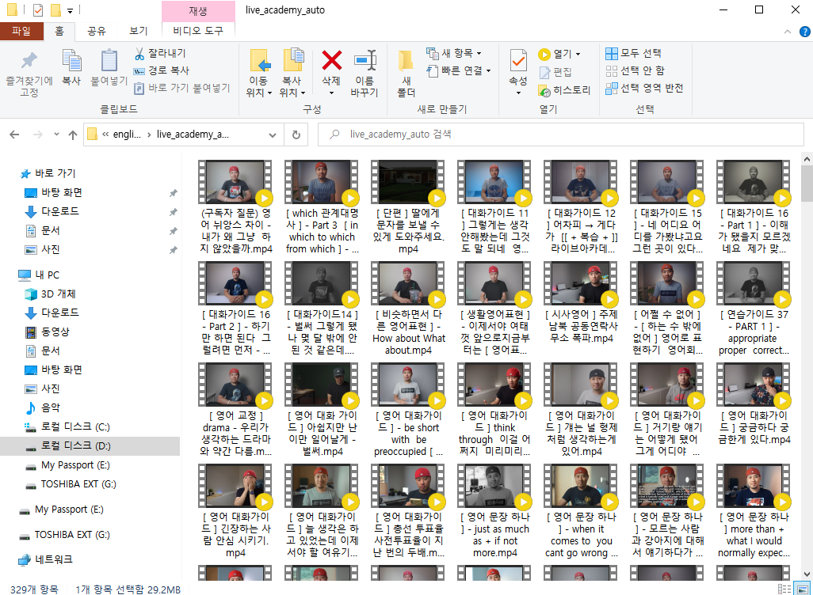

## Auto_youtubeVideo_downloader (오토 유튜브 동영상 다운로더)

## Requirement

* pytube3
* BeautifulSoup
* pandas
* tqdm
* selenium

## How to use it

1. Change your url address in pytube_download_v1.1.py
2. write your save video path at down_path in pytube_download_v1.1.py
3. and run pytube_download.py
4. If it isn't working properly, try to excute 1~3 ways at pytube_download.py file again.

-> It support only 720p resolution

## chrome driver download

https://sites.google.com/a/chromium.org/chromedriver/downloads

## Recommend

If you use it several times, you might be get IP ban from Youtube..
